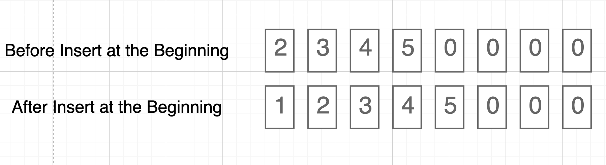

## Input - Output
Input: [2, 3, 4, 5], Insert 1 to index 0  
Output: [1, 2, 3, 4, 5]

## Step by Step Cost
1. Move existing elements to the next index O(n)
2. Insert the element O(1)

## Final asymptotic complexities
Time: O(n)
Space: O(n)

